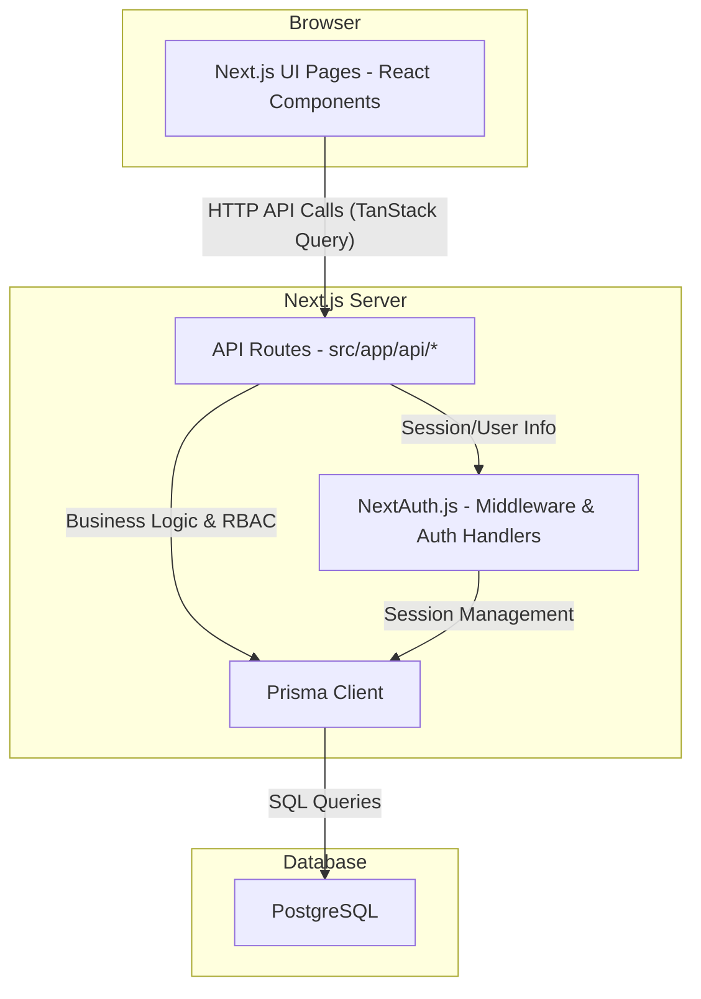

# PropertyOS: Integration Guide and Technical Runbook

## 1. Scope and Objectives

This document outlines the technical plan to integrate the PropertyOS frontend UI with its backend services. The primary objectives are:
-   Connect the UI to live backend APIs for key user workflows: **Maintenance**, **Payments/Financials**, and the **Tenant Dashboard**.
-   Fix known bugs, inconsistencies, and build-blockers in the existing API routes.
-   Standardize API contracts, data models, authentication/authorization patterns, and observability practices across the application.
-   Provide a clear, sequenced plan for implementation, testing, and rollout.

## 2. System Architecture

The system is a modern web application built on Next.js, using the App Router for both UI pages and API routes.

-   **Frontend**: React 19 with Next.js 15, styled with Tailwind CSS and using shadcn/ui components. Client-side state and server communication are managed by TanStack Query.
-   **Backend**: API routes are defined under `src/app/api/`. Business logic interacts with a PostgreSQL database via the Prisma ORM.
-   **Authentication**: Handled by NextAuth.js, with user sessions and role-based access control (RBAC).
-   **Database**: PostgreSQL, with the schema managed by Prisma migrations.

### Component & Data Flow Diagram



## 3. Domain Model Canon & Schema Updates

To ensure consistency, all development must adhere to the following standards.

-   **Enums**: API responses must use **UPPERCASE_SNAKE_CASE** for enum values, matching the Prisma schema definition (e.g., `MAINTENANCE_STATUS = 'IN_PROGRESS'`). The UI is responsible for any cosmetic mapping (e.g., "In Progress").
-   **Dates**: All date and datetime fields in API responses must be serialized to **ISO 8601 strings**. The UI is responsible for formatting for display.

### Prisma Schema Updates

The following changes are required in `prisma/schema.prisma` to support financial workflows.

```prisma
// prisma/schema.prisma

// Add new enum for PaymentType
enum PaymentType {
  RENT
  EXPENSE
}

// Update the Payment model
model Payment {
  id            String        @id @default(uuid())
  amount        Decimal
  status        PaymentStatus
  dueDate       DateTime
  paymentDate   DateTime?

  // NEW FIELDS
  type          PaymentType   @default(RENT) // Differentiate rent from other expenses
  method        String?       // e.g., 'card', 'bank_transfer'
  maintenanceId String?       // Foreign key to link an expense to a maintenance request

  // RELATIONS
  propertyId    String
  property      Property      @relation(fields: [propertyId], references: [id])
  tenancyId     String?
  tenancy       Tenancy?      @relation(fields: [tenancyId], references: [id])
  landlordId    String
  landlord      User          @relation("LandlordPayments", fields: [landlordId], references: [id])

  // Add relation to MaintenanceRequest
  maintenance   MaintenanceRequest? @relation(fields: [maintenanceId], references: [id])

  @@index([landlordId, status, type])
}

model MaintenanceRequest {
  // ... existing fields
  payments Payment[] // Add back-relation
}
```

**Action**: Apply these schema changes and run `npx prisma migrate dev --name add_payment_type_and_links`.

## 4. API Specifications

### 4.1. Maintenance API (`/api/maintenance`)

#### `PATCH /api/maintenance`

Updates a maintenance request. This is the primary endpoint for assigning contractors, tracking progress, and marking requests as complete.

-   **RBAC**:
    -   `ADMIN` / `LANDLORD`: Can update any field on any request within their scope.
    -   `TENANT`: Can only update requests they reported (`reportedBy`), and with limited field access.
-   **Workflow**: If a request is marked `COMPLETED` and an `actualCost` is provided, this endpoint will automatically create a corresponding `EXPENSE` record in the `Payment` table.

**Zod Validation Schema:**
```typescript
// src/app/api/maintenance/route.ts (inside PATCH handler)
import { z } from 'zod';
import { MaintenanceStatus } from '@prisma/client';

const updateSchema = z.object({
  id: z.string().uuid(),
  status: z.nativeEnum(MaintenanceStatus).optional(),
  assignedTo: z.string().uuid().optional().nullable(), // Allow un-assigning
  priority: z.enum(['LOW', 'MEDIUM', 'HIGH']).optional(),
  actualCost: z.number().nonnegative().optional(),
  dueDate: z.string().datetime().optional(),
});
```

**Handler Implementation:**
```typescript
// src/app/api/maintenance/route.ts
import { getServerSession } from 'next-auth';
import { NextRequest, NextResponse } from 'next/server';
import { AppError, ErrorCode } from '@/lib/errors';
import { createAuditLog } from '@/lib/audit';
import { db } from '@/lib/db';
import { authOptions } from '@/lib/auth';


export async function PATCH(req: NextRequest) {
  const session = await getServerSession(authOptions);
  if (!session?.user?.id) throw new AppError('Unauthorized', 401, ErrorCode.UNAUTHORIZED);

  const input = updateSchema.parse(await req.json());

  const existing = await db.maintenanceRequest.findUnique({ where: { id: input.id } });
  if (!existing) throw new AppError('Not Found', 404, ErrorCode.NOT_FOUND);

  // Enforce tenant permissions
  if (session.user.role === 'TENANT' && existing.reportedBy !== session.user.id) {
    throw new AppError('Insufficient Permissions', 403, ErrorCode.INSUFFICIENT_PERMISSIONS);
  }

  const updated = await db.maintenanceRequest.update({
    where: { id: input.id },
    data: {
      status: input.status,
      assignedTo: input.assignedTo,
      priority: input.priority,
      actualCost: input.actualCost,
      dueDate: input.dueDate ? new Date(input.dueDate) : undefined,
    },
  });

  // If completed with a cost, create an expense record
  if (updated.status === 'COMPLETED' && updated.actualCost && updated.actualCost > 0) {
    await db.payment.create({
      data: {
        amount: updated.actualCost,
        status: 'COMPLETED', // Expenses are logged as completed payments
        type: 'EXPENSE',
        maintenanceId: updated.id,
        propertyId: existing.propertyId,
        landlordId: existing.landlordId, // Assuming landlordId is on the maintenance request
        dueDate: new Date(),
      },
    });
  }

  await createAuditLog({
    userId: session.user.id,
    action: 'update_maintenance_request',
    resource: 'maintenance_request',
    resourceId: updated.id,
    changes: { before: existing, after: updated },
    result: 'success'
  });

  return NextResponse.json({ maintenanceRequest: updated });
}
```

### 4.2. Financials API (`/api/financial`)

This API is being refactored to correctly handle payments vs. expenses and to provide robust querying capabilities. The anti-pattern of creating maintenance requests from this endpoint will be removed.

#### `GET /api/financial`

Fetches a list of financial transactions (`Payment` table) with filtering and cursor-based pagination.

-   **RBAC**: `ADMIN` / `LANDLORD` only.
-   **Query Params**:
    -   `status`: `PENDING` | `COMPLETED` | `FAILED`
    -   `type`: `RENT` | `EXPENSE`
    -   `propertyId`: `string`
    -   `take`: `number` (default 20, max 100)
    -   `cursor`: `string` (the `id` of the last item from the previous page)

**Handler Implementation:**
```typescript
// src/app/api/financial/route.ts
import { Prisma, PaymentStatus, PaymentType } from '@prisma/client';
import { requireRole } from '@/lib/auth';


export async function GET(req: NextRequest) {
  const session = await getServerSession(authOptions);
  if (!session?.user?.id) throw new AppError('Unauthorized', 401, ErrorCode.UNAUTHORIZED);
  requireRole(session, ['ADMIN', 'LANDLORD']);

  const { searchParams } = new URL(req.url);
  const where: Prisma.PaymentWhereInput = { landlordId: session.user.id };

  if (searchParams.get('status')) where.status = searchParams.get('status') as PaymentStatus;
  if (searchParams.get('type')) where.type = searchParams.get('type') as PaymentType;
  if (searchParams.get('propertyId')) where.propertyId = searchParams.get('propertyId');

  const take = Math.min(Number(searchParams.get('take') ?? 20), 100);
  const cursor = searchParams.get('cursor') ?? undefined;

  const items = await db.payment.findMany({
    where,
    orderBy: { dueDate: 'desc' },
    take,
    ...(cursor ? { skip: 1, cursor: { id: cursor } } : {})
  });

  return NextResponse.json({
    items,
    nextCursor: items.length === take ? items[items.length - 1]?.id : null
  });
}
```

### 4.3. Tenant APIs (`/api/tenant/...`)

These endpoints must be fixed to ensure correctness and consistency.

-   **File**: `src/app/api/tenant/dashboard/route.ts`
    -   **Fix**: Correct the function signature `exportasync function GET` to `export async function GET`.
    -   **Fix**: Remove corrupted comment `// 30 days from nowconstdata =`.
    -   **Standardize**: Ensure all `status` enums are returned as uppercase strings.
    -   **Standardize**: Serialize all dates to ISO 8601 strings.
    -   **Remove Mocks**: Remove hardcoded phone numbers and payment methods.
-   **File**: `src/app/api/tenant/[tenantId]/route.ts`
    -   **Standardize**: Align the response shape, enum casing, and date serialization with the `dashboard` route.
    -   **Add Auth**: Ensure robust RBAC is in place, verifying the logged-in user is the tenant in question or their landlord.

## 5. Frontend Integration

### 5.1. Tenant Dashboard (`/tenant-dashboard`)

The dashboard will be refactored to use TanStack Query to fetch live data, replacing mock fallbacks.

```typescript
// src/app/tenant-dashboard/page.tsx
'use client';

import { useQuery } from '@tanstack/react-query';
import { TenantDashboardData } from '@/types'; // Assuming a type for the API response
import { DashboardSkeleton } from '@/components/skeletons';
import { ErrorState } from '@/components/error-state';


async function fetchTenantDashboard(): Promise<TenantDashboardData> {
  const res = await fetch('/api/tenant/dashboard');
  if (!res.ok) {
    throw new Error('Failed to fetch dashboard data');
  }
  return res.json();
}

export default function TenantDashboardPage() {
  const { data, isLoading, error } = useQuery({
    queryKey: ['tenantDashboard'],
    queryFn: fetchTenantDashboard,
  });

  if (isLoading) return <DashboardSkeleton />;
  if (error) return <ErrorState message={error.message} />;

  // Render dashboard components with `data`
  return (
    <div>
      {/* 
      <SummaryCards summary={data.summary} />
      <RecentMaintenance requests={data.recentRequests} />
      <PaymentHistory payments={data.paymentHistory} /> 
      */}
    </div>
  );
}
```

### 5.2. Maintenance UI (`/maintenance`)

UI actions will be wired to the `PATCH /api/maintenance` endpoint using optimistic updates to provide a responsive user experience.

```typescript
// src/hooks/use-maintenance-mutations.ts
import { useMutation, useQueryClient } from '@tanstack/react-query';
import { MaintenanceStatus } from '@prisma/client';


export const useUpdateMaintenance = () => {
  const queryClient = useQueryClient();

  return useMutation({
    mutationFn: async (variables: { id: string; status?: MaintenanceStatus; assignedTo?: string | null }) => {
      const res = await fetch('/api/maintenance', {
        method: 'PATCH',
        headers: { 'Content-Type': 'application/json' },
        body: JSON.stringify(variables),
      });
      if (!res.ok) throw new Error('Update failed');
      return res.json();
    },
    onMutate: async (newData) => {
      await queryClient.cancelQueries({ queryKey: ['maintenanceList'] });
      const previousData = queryClient.getQueryData(['maintenanceList']);

      // Optimistically update the local cache
      queryClient.setQueryData(['maintenanceList'], (old: any) => {
        return old.map((req: any) => req.id === newData.id ? { ...req, ...newData } : req);
      });

      return { previousData };
    },
    onError: (err, newData, context: any) => {
      // Rollback on failure
      if (context?.previousData) {
        queryClient.setQueryData(['maintenanceList'], context.previousData);
      }
      // toast.error('Failed to update request');
    },
    onSettled: () => {
      // Invalidate to re-sync with the server
      queryClient.invalidateQueries({ queryKey: ['maintenanceList'] });
    },
  });
};

/*
// In a component:
const mutation = useUpdateMaintenance();
const handleAssign = (requestId: string, contractorId: string) => {
  mutation.mutate({ id: requestId, assignedTo: contractorId, status: 'IN_PROGRESS' });
};
*/
```

## 6. AuthN & AuthZ

### 6.1. Middleware

A `middleware.ts` file at the root of `src` will protect all application and API routes by default.

```typescript
// src/middleware.ts
import { withAuth } from 'next-auth/middleware';
import { NextResponse } from 'next/server';

export default withAuth(
  function middleware(req) {
    // Add any additional logic here if needed, e.g., checking roles
    return NextResponse.next();
  },
  {
    callbacks: {
      authorized: ({ token }) => !!token, // Protects routes if user is not logged in
    },
  }
);

export const config = {
  // Protect all routes except for public pages like login, signup, landing page
  matcher: [
    '/dashboard/:path*',
    '/properties/:path*',
    '/maintenance/:path*',
    '/financial/:path*',
    '/tenant-dashboard/:path*',
    '/api/((?!auth|public).*)', // Protect all API routes except auth and public ones
  ],
};
```

### 6.2. RBAC Helpers

Use a centralized helper to check roles within API routes to keep logic DRY.

```typescript
// src/lib/auth-utils.ts
import { Session } from 'next-auth';
import { AppError, ErrorCode } from './errors';
import { UserRole } from '@prisma/client';

export function requireRole(session: Session | null, allowedRoles: UserRole[]) {
  if (!session?.user?.role || !allowedRoles.includes(session.user.role)) {
    throw new AppError('Insufficient Permissions', 403, ErrorCode.INSUFFICIENT_PERMISSIONS);
  }
}
```

## 7. Observability and Audit

-   **Request ID**: Every API handler should generate a request ID and log it with any errors for traceability. This ID should also be returned in the `X-Request-Id` response header.
-   **Audit Log**: All mutating operations (`POST`, `PATCH`, `DELETE`) **must** create an audit trail by calling the `createAuditLog` function on both success and failure. The log should capture the user, action, resource, and a diff of the changes.

## 8. Testing Strategy

-   **Unit Tests (Jest)**:
    -   Zod schemas for API inputs.
    -   RBAC helper functions (`requireRole`).
    -   State transition logic (e.g., can a request move from `OPEN` to `COMPLETED` directly?).
-   **Integration Tests (Jest + Prisma)**:
    -   API route round-trips: `POST` a maintenance request, `PATCH` it to completion, then `GET` from the financial API to verify the expense was created.
    -   Test pagination, filtering, and sorting on `GET` endpoints.
-   **E2E Tests (Playwright)**:
    -   **Happy Path**: A tenant logs in, creates a maintenance request. A landlord logs in, assigns it, completes it. The tenant sees the updated status.
    -   **Error Path**: An API call fails, and the UI shows an error toast while rolling back the optimistic update.

## 9. Sequencing and Known Issues

The implementation will follow a phased approach to mitigate risk and deliver value incrementally.

1.  **Phase 1: Stabilize & Standardize (1-2 days)**
    -   **Action**: Fix the build-breaking bugs in `src/app/api/tenant/dashboard/route.ts`.
    -   **Action**: Standardize all enum casing and date serialization across all tenant-facing and financial API endpoints.
    -   **Action**: Remove all mock data from API responses.
    -   **Action**: Add regression tests (unit/snapshot) for the tenant API response shapes to prevent future drift.

2.  **Phase 2: Implement Core Backend Logic (2-3 days)**
    -   **Action**: Apply the Prisma schema changes for the `Payment` model.
    -   **Action**: Implement the `PATCH /api/maintenance` handler, including the expense creation logic.
    -   **Action**: Refactor the `GET /api/financial` endpoint with correct filtering and pagination.

3.  **Phase 3: Wire UI & Add Middleware (2 days)**
    -   **Action**: Implement the `middleware.ts` file to protect all necessary routes.
    -   **Action**: Wire the Maintenance and Financials pages to the live APIs using TanStack Query, including optimistic updates.
    -   **Action**: Refactor the Tenant Dashboard to use the stabilized live API.

4.  **Phase 4: Comprehensive Testing (2-3 days)**
    -   **Action**: Write unit and integration tests for all new and modified backend logic.
    -   **Action**: Write E2E tests for the complete maintenance and payment viewing workflows.

Refer to `DEPLOYMENT.md` and `PRODUCTION-CHECKLIST.md` for deployment procedures and production readiness criteria.
